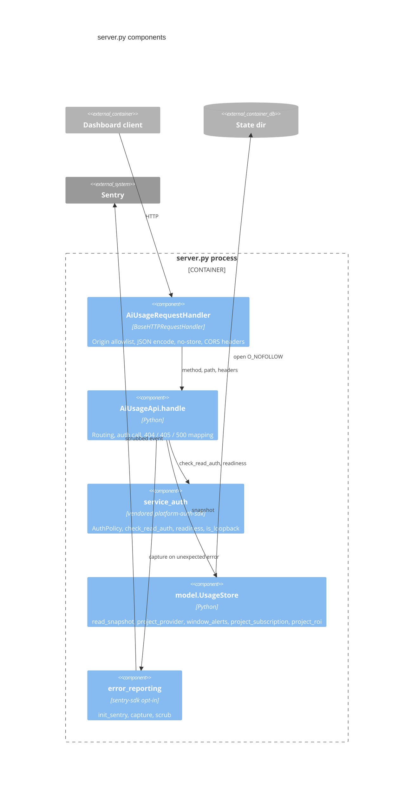
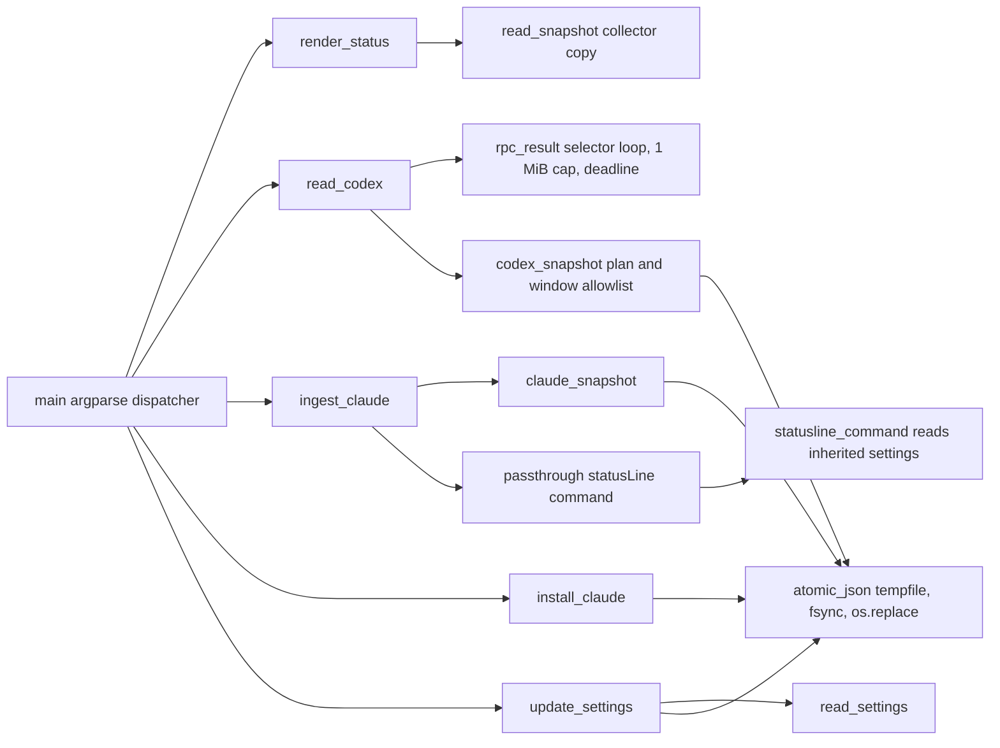

# 07 — C4 Component

## server.py (API)

```mermaid
C4Component
  title server.py components
  Container_Ext(dash, "Dashboard client")
  ContainerDb_Ext(state, "State dir")
  System_Ext(sentry, "Sentry")
  Container_Boundary(api, "server.py process") {
    Component(handler, "AiUsageRequestHandler", "BaseHTTPRequestHandler", "Origin allowlist, JSON encode, no-store, CORS headers")
    Component(app, "AiUsageApi.handle", "Python", "Routing, auth call, 404 / 405 / 500 mapping")
    Component(auth, "service_auth", "vendored platform-auth-sdk", "AuthPolicy, check_read_auth, readiness, is_loopback")
    Component(store, "model.UsageStore", "Python", "read_snapshot, project_provider, window_alerts, project_subscription, project_roi")
    Component(er, "error_reporting", "sentry-sdk opt-in", "init_sentry, capture, scrub")
  }
  Rel(dash, handler, "HTTP")
  Rel(handler, app, "method, path, headers")
  Rel(app, auth, "check_read_auth, readiness")
  Rel(app, store, "snapshot")
  Rel(store, state, "open O_NOFOLLOW")
  Rel(app, er, "capture on unexpected error")
  Rel(er, sentry, "scrubbed event")
```

## collector.py (CLI)

```mermaid
flowchart LR
  MAIN["main argparse dispatcher"] --> ST["render_status"]
  MAIN --> RC["read_codex"]
  RC --> RPC["rpc_result selector loop, 1 MiB cap, deadline"]
  RC --> CS["codex_snapshot plan and window allowlist"]
  MAIN --> IC["ingest_claude"]
  IC --> CLS["claude_snapshot"]
  IC --> PT["passthrough statusLine command"]
  PT --> SLC["statusline_command reads inherited settings"]
  MAIN --> INS["install_claude"]
  MAIN --> UPD["update_settings"]
  UPD --> RS["read_settings"]
  CS --> AJ["atomic_json tempfile, fsync, os.replace"]
  CLS --> AJ
  UPD --> AJ
  INS --> AJ
  ST --> RSN["read_snapshot collector copy"]
```

Sources: `server.py`, `model.py`, `error_reporting.py`, `vendor/service-auth/service_auth/__init__.py`, `collector.py`
